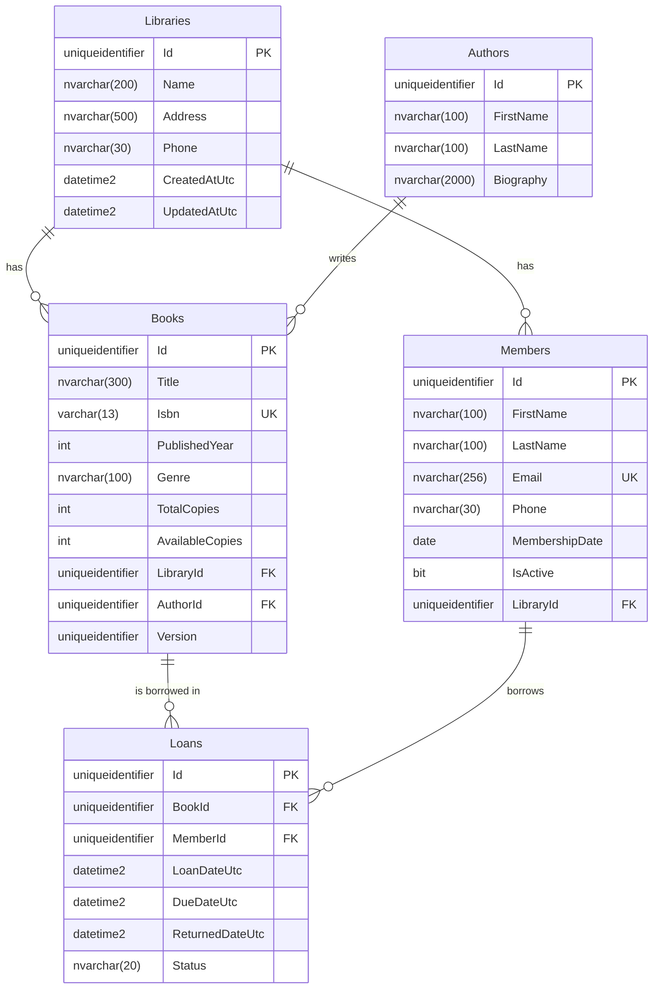

# Library Management System – Web API

A .NET 8 Web API for managing libraries, authors, books, members and book loans, built with **Clean Architecture** and **CQRS** (MediatR).

## Tech Stack

| Area | Technology |
|---|---|
| Framework | .NET 8, ASP.NET Core Web API (controllers) |
| CQRS / Mediator | MediatR 12 |
| Validation | FluentValidation 11 |
| Data access | Entity Framework Core 8, SQL Server LocalDB |
| API docs | Swagger (Swashbuckle) |
| Testing | xUnit, FluentAssertions, NSubstitute |

## Architecture

```
src/
  LibraryManagement.Domain          Entities, value objects, business rules (no dependencies)
  LibraryManagement.Application     CQRS commands/queries, handlers, validators, interfaces
  LibraryManagement.Infrastructure  EF Core DbContext, configurations, repositories, migrations
  LibraryManagement.Api             Controllers, error handling, Swagger, startup
tests/
  LibraryManagement.Domain.UnitTests
  LibraryManagement.Application.UnitTests
```

Dependencies point inward only: **Api → Infrastructure → Application → Domain**.

### CQRS

- **Commands** (create, update, delete, borrow, return) load entities through **repositories**, let the domain apply its rules, then save with **`IUnitOfWork`**.
- **Queries** (get by id, lists) read through **`IReadDbContext`** (no-tracking) and project straight to DTOs.
- Every request passes through a MediatR pipeline: **Logging → Validation → Handler**.

```
HTTP → Controller → MediatR → LoggingBehavior → ValidationBehavior → Handler → Domain / Database
```

### OOP and best practices

- **Encapsulation:** entities have private setters and change only through methods such as `Book.CheckOut()` and `Member.Deactivate()`.
- **Factory methods:** `Book.Create(...)` and the like always produce a valid object.
- **Value objects:** `Isbn` (validates and normalises ISBN-10/13) and `Email` (case-insensitive).
- **Domain service:** `LoanPolicy` holds the borrowing rules that involve Book, Member and Loan.
- **Dependency inversion:** Application defines interfaces; Infrastructure implements them.
- **Single responsibility:** one file per use case (command or query, validator, handler).
- **Async all the way down,** with `CancellationToken` passed from each HTTP request to the database.
- **Consistent errors:** every error is returned as RFC 7807 **ProblemDetails**.

## Entities

| Entity | Main fields | Behaviour |
|---|---|---|
| **Library** | Name, Address, Phone | Create, Update |
| **Author** | FirstName, LastName, Biography | Create, Update |
| **Book** | Title, Isbn, PublishedYear, Genre, TotalCopies, AvailableCopies, LibraryId, AuthorId | CheckOut, ReturnCopy, Update |
| **Member** | FirstName, LastName, Email, Phone, MembershipDate, IsActive, LibraryId | Activate, Deactivate, Update |
| **Loan** | BookId, MemberId, LoanDateUtc, DueDateUtc, ReturnedDateUtc, Status | Created on Borrow, closed on Return |

## Database Schema



**Constraints:**
- `Books.Isbn` and `Members.Email` are unique.
- Check constraint: `0 <= AvailableCopies <= TotalCopies`.
- Libraries and Authors cannot be deleted while they still have books or members (restrict).
- Deleting a Book or Member also deletes its returned-loan history. Deletion is refused while it has active loans.
- `Books.Version` is an optimistic-concurrency token, so two people cannot both borrow the last copy.

## API Endpoints

Base URL: `/api/v1`. All list endpoints accept `page` (default 1) and `pageSize` (default 20, max 100).

### Libraries
| Method | Route | Description |
|---|---|---|
| GET | `/libraries?search=` | List libraries |
| GET | `/libraries/{id}` | Get a library |
| POST | `/libraries` | Create a library |
| PUT | `/libraries/{id}` | Update a library |
| DELETE | `/libraries/{id}` | Delete (409 if it has books or members) |

### Authors
| Method | Route | Description |
|---|---|---|
| GET | `/authors?search=` | List authors |
| GET | `/authors/{id}` | Get an author |
| POST | `/authors` | Create an author |
| PUT | `/authors/{id}` | Update an author |
| DELETE | `/authors/{id}` | Delete (409 if the author has books) |

### Books
| Method | Route | Description |
|---|---|---|
| GET | `/books?search=&isbn=&authorId=&libraryId=&available=` | Search books |
| GET | `/books/{id}` | Get a book |
| POST | `/books` | Add a book (409 on duplicate ISBN) |
| PUT | `/books/{id}` | Update (409 if copies drop below those on loan) |
| DELETE | `/books/{id}` | Delete (409 if copies are on loan) |

### Members
| Method | Route | Description |
|---|---|---|
| GET | `/members?search=&libraryId=&isActive=` | List members |
| GET | `/members/{id}` | Get a member |
| POST | `/members` | Register (409 on duplicate email) |
| PUT | `/members/{id}` | Update a member |
| DELETE | `/members/{id}` | Delete (409 if the member has active loans) |
| PATCH | `/members/{id}/activate` | Activate a member |
| PATCH | `/members/{id}/deactivate` | Deactivate a member |
| GET | `/members/{id}/loans?status=` | List a member's loans |

### Loans
| Method | Route | Description |
|---|---|---|
| GET | `/loans?memberId=&bookId=&status=&overdue=` | List loans (newest first) |
| GET | `/loans/{id}` | Get a loan |
| POST | `/loans` | Borrow a book: `{ "bookId": "...", "memberId": "..." }` |
| POST | `/loans/{id}/return` | Return a book |

### Example: borrow a book

```http
POST /api/v1/loans
Content-Type: application/json

{ "bookId": "3f2b…", "memberId": "9a1c…" }
```

```json
201 Created
{
  "id": "c7d4…",
  "bookId": "3f2b…",
  "bookTitle": "Clean Code",
  "memberId": "9a1c…",
  "memberName": "Ada Lovelace",
  "loanDateUtc": "2026-10-06T09:00:00",
  "dueDateUtc": "2026-10-20T09:00:00",
  "returnedDateUtc": null,
  "status": "Active",
  "isOverdue": false
}
```

### Status codes
| Code | When |
|---|---|
| 200 / 201 / 204 | Success (201 includes a `Location` header) |
| 400 | Validation failed; `errors` lists each field |
| 404 | Resource not found |
| 409 | Business rule broken, duplicate value, or concurrent update |
| 500 | Unexpected error (details are logged, not returned) |

## Business Rules

- A loan lasts **14 days**.
- A member can have at most **5 active loans**.
- A member cannot borrow the same book twice at the same time.
- Inactive members cannot borrow.
- Members can only borrow books from their own library.
- A book cannot be borrowed when no copies are available.
- A loan can only be returned once.
- ISBNs must be valid ISBN-10 or ISBN-13; hyphens and spaces are accepted.

## Getting Started

### Prerequisites
- .NET 8 SDK or later (with the ASP.NET Core 8 runtime)
- SQL Server LocalDB (installed with Visual Studio)

### Run
```bash
git clone <repo-url>
cd <repo-folder>
dotnet run --project src/LibraryManagement.Api --launch-profile https
```
Then open **https://localhost:7080/swagger**.

In Development, the app **applies EF Core migrations and seeds sample data automatically**: one library, two authors, three books and one member.

To apply migrations manually instead:
```bash
dotnet tool restore
dotnet ef database update --project src/LibraryManagement.Infrastructure --startup-project src/LibraryManagement.Api
```

The connection string is in `src/LibraryManagement.Api/appsettings.json` (`ConnectionStrings:LibraryDb`).

### Run the tests
```bash
dotnet test
```
86 unit tests cover the domain rules, command handlers, validators and pipeline behaviours.